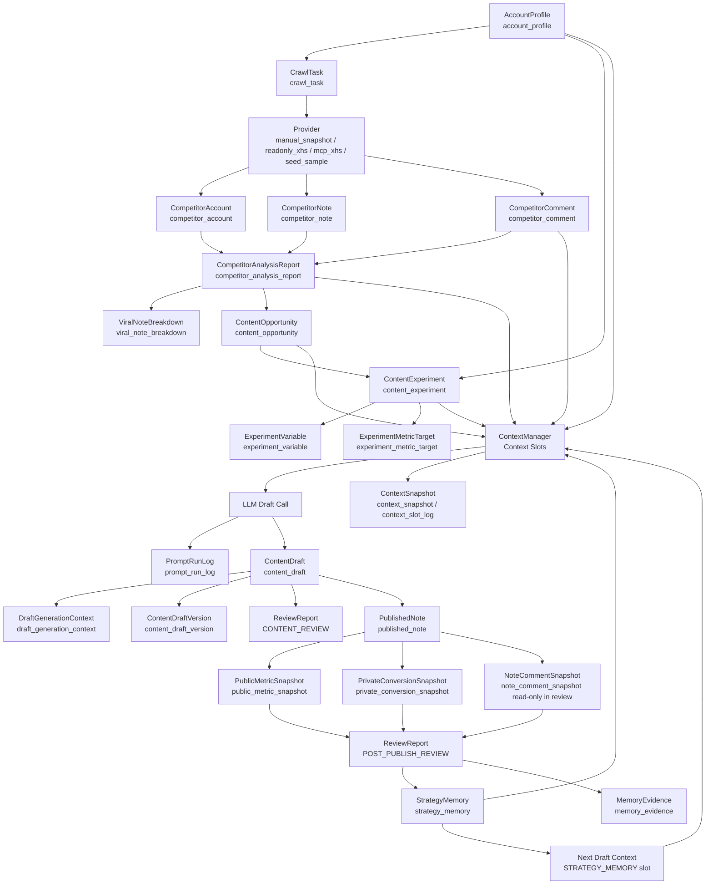
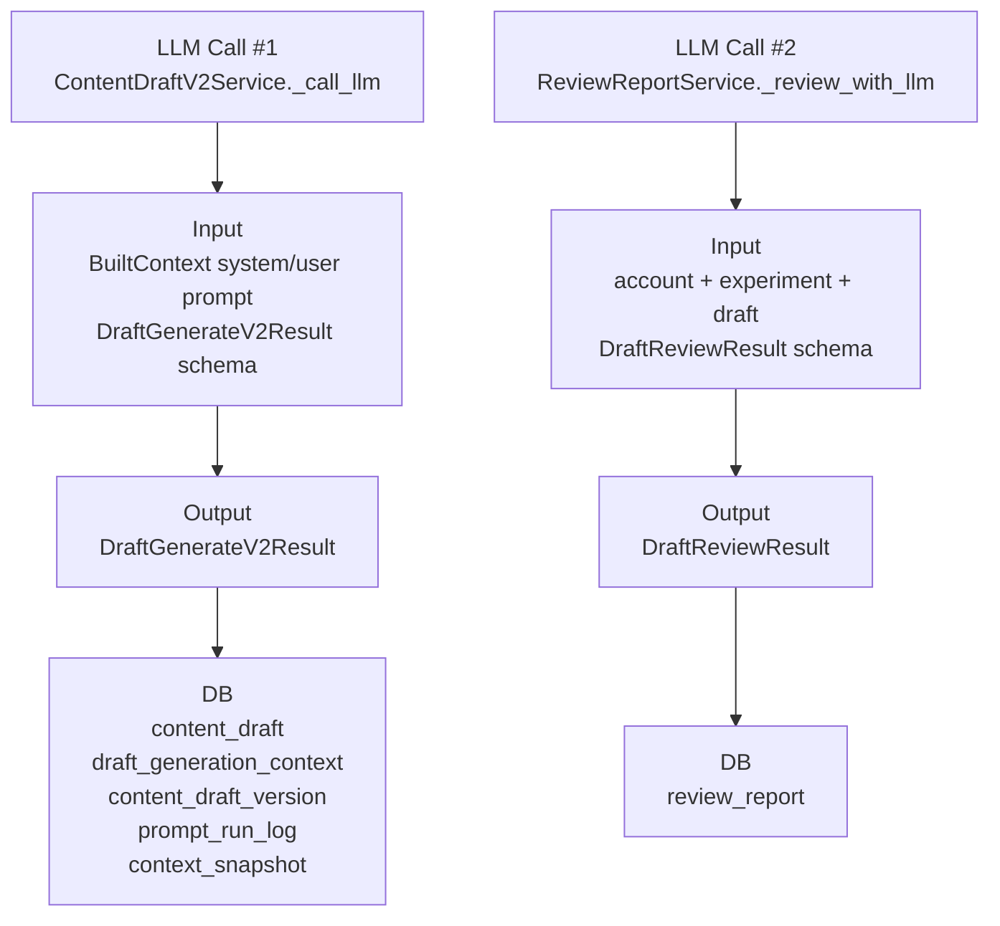

# 1. 当前业务总流程

本报告只保留当前新的主业务链路：`CrawlerCollection / CompetitorNote / CompetitorReport / ContentOpportunity / ContentExperimentV2 / ContentDraftV2 / PostPublish / StrategyMemory`。旧的笔记快照分析链路不在本文展开。

当前真实代码中的主链路是：

```text
账号画像 AccountProfile
↓
采集任务 CrawlTask
↓
Provider 输出 CompetitorAccount / CompetitorNote / CompetitorComment
↓
CompetitorReportService 生成 CompetitorAnalysisReport
├─ ViralNoteBreakdown
└─ ContentOpportunity
↓
ContentExperimentV2Service 生成 ContentExperiment + ExperimentVariable + ExperimentMetricTarget
↓
人工 approve experiment
↓
ContentDraftV2Service 构建 Context Slot 并调用 LLM
↓
ContentDraft + DraftGenerationContext +  PromptRunLog + ContextSnapshot
↓
ReviewReportService 可对草稿做 LLM 审核
↓
PublishedNote + PublicMetricSnapshot + PrivateConversionSnapshot
↓
PostPublishService 生成发布后 ReviewReport
↓
extract_memories 生成 StrategyMemory + MemoryEvidence
↓
下一轮 ContentDraftV2 读取 StrategyMemory 注入 Prompt
```

关键差异：

- 竞品报告、爆款拆解、评论需求、内容机会、内容实验、发布后复盘、策略记忆提取，当前主要是 Python 规则和数据库读写，不调用 LLM。
- 真实 LLM 调用主要出现在 `content_draft_v2` 草稿生成 / 重生成，以及 `ReviewReportService.review_draft()` 草稿审核。
- 当前没有完整的自由输入 Router / Planner / Feedback Handler，所以用户自然语言反馈不会自动进入业务链路。
- Strategy Memory 会进入下一轮草稿生成，但来源仅是发布后复盘提取出的候选记忆，不来自普通用户反馈。

关键代码位置： 

- `backend/app/services/crawler_collection_sev.py`，`CrawlerCollectionService.run_task()`
- `backend/app/services/competitor_report_sev.py`，`CompetitorReportService.create_report()`
- `backend/app/services/content_experiment_v2_sev.py`，`ContentExperimentV2Service.generate_experiments()`
- `backend/app/services/content_draft_v2_sev.py`，`ContentDraftV2Service.generate_draft()`
- `backend/app/services/review_report_sev.py`，`ReviewReportService.review_draft()`
- `backend/app/services/post_publish_sev.py`，`PostPublishService.create_review()` / `extract_memories()`

# 2. 数据采集层

## 输入

入口 DTO 是 `CrawlTaskCreate`：

```text
account_id
task_type
provider_name
keyword
input_payload
```

Provider 输出 DTO 是：

```text
CompetitorAccountCreate:
account_id, platform, platform_account_id, nickname, homepage_url, bio,
follower_count, note_count, source_type, provider_name, is_mock,
confidence, raw_snapshot

CompetitorNoteCreate:
account_id, competitor_account_id, note_id, note_url, author_name,
title, content, tags, like_count, collect_count, comment_count,
source_type, provider_name, is_mock, confidence, raw_snapshot

CompetitorCommentCreate:
account_id, competitor_note_id, comment_id, user_name, content,
like_count, source_type, provider_name, is_mock, confidence, raw_snapshot
```

代码位置：

- `backend/app/schemas/crawler_collection.py`
- `backend/app/models/crawl_task.py`
- `backend/app/models/competitor_account.py`
- `backend/app/models/competitor_note.py`
- `backend/app/models/competitor_comment.py`

## 输入从哪里来

当前 Provider：

- `manual_snapshot`：用户手动整理的真实公开快照。
- `manual`：人工录入 Provider。
- `readonly_xhs`：只读公开快照，不登录、不互动。
- `mcp_xhs`：MCP 预留 Provider。
- `seed_sample`：显式 demo/test 使用的 Seed 样本，`is_mock=True`。

代码位置：

- `backend/app/crawler/providers/manual_snapshot_provider.py`
- `backend/app/crawler/providers/manual.py`
- `backend/app/crawler/providers/readonly_xhs_provider.py`
- `backend/app/crawler/providers/seed_sample.py`
- `backend/app/crawler/providers/factory.py`

## 做什么

`CrawlerCollectionService.run_task()`：

1. 把任务状态改成 `RUNNING`；
2. 按 Provider 链采集；
3. 给所有输出打 `provider_name / source_type / is_mock / raw_snapshot`；
4. 保存同行账号、竞品笔记、竞品评论；
5. 未指定同行账号的笔记绑定到本次第一个同行账号；
6. 未指定笔记的评论绑定到本次第一篇笔记；
7. 更新任务状态为 `SUCCESS` 或 `FAILED`。

这里不调用 LLM。

## 输出

数据库对象：

- `CrawlTask`
- `CompetitorAccount`
- `CompetitorNote`
- `CompetitorComment`

## 保存在哪里

保存到：

- `crawl_task`
- `competitor_account`
- `competitor_note`
- `competitor_comment`

原始 Provider payload 会进入各对象的 `raw_snapshot`。

## 谁继续使用

- `CompetitorReportRepository.list_competitor_accounts()` 读取 `CompetitorAccount`。
- `CompetitorReportRepository.list_competitor_notes()` 读取非 Mock 的 `CompetitorNote`。
- `CompetitorReportRepository.list_comments_for_notes()` 读取对应笔记下的 `CompetitorComment`。
- `ContentDraftV2Service._comment_sample_items()` 后续也会回查 `CompetitorComment` 作为 `COMMENT_INSIGHT`。

## 数据不存在会怎样

- 没有账号：`create_task()` 抛 `账号配置不存在`。
- Provider 没有返回数据：`manual` 抛 `MANUAL_SNAPSHOT_REQUIRED`。
- 所有 Provider 失败：`run_task()` 标记任务 `FAILED`，写 `error_message`。
- Seed 只允许显式选择，生产 Provider 链默认不包含 seed。

# 3. 账号画像

## 对应 Model / Table

账号画像对应：

```text
Model: AccountProfile
Table: account_profile
```

代码位置：

- `backend/app/models/account.py`
- `backend/app/schemas/account.py`
- `backend/app/services/account_sev.py`
- `backend/app/repositories/account_repo.py`

## 字段分类

基础账号信息：

```text
id
account_name
platform
homepage_url
content_domain
created_at
updated_at
```

账号定位：

```text
positioning
persona
account_stage
```

目标用户：

```text
target_audience
```

内容主题：

```text
content_domain
forbidden_topics
```

内容风格：

```text
tone_preference
risk_preference
```

历史表现：

```text
当前 AccountProfile 表没有历史表现字段。
历史表现位于 PublishedNote / PublicMetricSnapshot / ReviewReport / StrategyMemory。
```

用户偏好：

```text
tone_preference
forbidden_topics
risk_preference
```

竞争定位：

```text
当前 AccountProfile 表没有独立竞争定位字段。
竞品相关信息在 CompetitorAnalysisReport 中。
```

运营目标：

```text
monetization_goal
business_model
main_product
lead_value
avg_order_value
gross_profit
primary_goal
```

LLM 分析结果：

```text
当前 AccountProfile 不是 LLM 生成画像，没有单独 LLM 分析结果字段。
```

其他：

```text
created_at
updated_at
```

## 输入

`AccountProfileCreate`：

```text
account_name, platform, homepage_url, content_domain, positioning,
target_audience, persona, monetization_goal, business_model,
main_product, lead_value, avg_order_value, gross_profit,
primary_goal, tone_preference, forbidden_topics, risk_preference,
account_stage
```

## 输入从哪里来

用户手动创建或更新：

- `AccountProfileService.create_account()`
- `AccountProfileService.update_account()`

没有看到由 LLM 自动生成 Account Profile 的代码。

## 做什么

仅做 CRUD：

- 创建账号配置；
- 查询账号配置；
- 更新账号配置；
- 校验其他业务链路里的 `account_id` 是否存在。

没有 LLM、没有 SQL 聚合、没有画像生成算法。

## 输出

`AccountProfileResponse`，字段与表字段基本一致。

## 保存在哪里

保存到 `account_profile` 独立字段。

## 谁继续使用

- 采集任务：`CrawlerCollectionService._ensure_account_exists()`
- 竞品报告：`CompetitorReportService._ensure_account_exists()`
- 实验生成：`ContentExperimentV2Repository.get_account()`
- 草稿生成：`ContentDraftV2Service._get_account_or_raise()`，并进入 `ACCOUNT_PROFILE` slot
- 草稿审核：`ReviewReportService._build_review_context()`
- 发布后链路：`PostPublishService._ensure_account()`
- Confirmation：`ConfirmationService` 用于确认任务归属

ContentOpportunity 会不会读取：

- 当前不会直接读取账号画像。`CompetitorReportService._build_opportunities()` 只基于竞品分析结果生成机会。

Experiment 会不会读取：

- 会。`ContentExperimentV2Service.generate_experiments()` 读取 `AccountProfile`，使用 `account_stage` 决定 CTA 强度，使用 `target_audience` 作为控制变量兜底。

Draft 会不会读取：

- 会。`ContentDraftV2Service._build_context()` 把账号字段放入 `account_snapshot`，再进入 `ACCOUNT_PROFILE` slot。

Reviewer 会不会读取：

- 会。`ReviewReportService._build_review_context()` 读取账号名称、定位、目标用户、目标、风格偏好、禁用话题。

## 数据不存在会怎样

依赖账号的服务会直接抛错，例如：

- `账号配置不存在`
- `Account profile does not exist`

# 4. 同行 / 竞品分析

## 输入

`CompetitorReportCreate`：

```text
account_id
name
keyword
target_metric
limit
```

实际读取的数据库字段：

```text
CompetitorAccount:
id, account_id, nickname, bio, follower_count, note_count,
source_type, provider_name, is_mock, confidence, raw_snapshot

CompetitorNote:
id, account_id, competitor_account_id, note_id, note_url,
author_name, title, content, tags, like_count, collect_count,
comment_count, source_type, provider_name, is_mock, confidence,
raw_snapshot

CompetitorComment:
id, account_id, competitor_note_id, comment_id, user_name,
content, like_count, source_type, provider_name, is_mock,
confidence, raw_snapshot
```

## 输入从哪里来

来自数据采集层保存的：

- `competitor_account`
- `competitor_note`
- `competitor_comment`

报告只读取 `CompetitorNote.is_mock == False` 的竞品笔记。评论读取按 `account_id + competitor_note_id` 过滤，但没有单独再过滤 `CompetitorComment.is_mock`。

代码位置：

- `backend/app/repositories/competitor_report_repo.py`
- `CompetitorReportRepository.list_competitor_notes()`
- `CompetitorReportRepository.list_comments_for_notes()`

## 做什么

`CompetitorReportService.create_report()` 用纯 Python 规则分析：

- 校验账号是否存在；
- 查询同行账号；
- 查询非 Mock 竞品笔记；
- 按关键词过滤标题、正文、tags；
- 按收藏、点赞排序；
- 读取评论；
- 统计标题模式；
- 统计内容支柱；
- 统计高频 tags；
- 识别评论需求；
- 识别转化信号；
- 识别风险点；
- 计算高表现笔记；
- 计算可复制性；
- 生成报告摘要、洞察、建议；
- 同时生成爆款拆解和内容机会。

不调用 LLM。

主要规则位置：

- `COMMENT_DEMAND_RULES`
- `TITLE_PATTERN_RULES`
- `CONTENT_PILLAR_RULES`
- `CONVERSION_SIGNAL_RULES`
- `RISK_RULES`

代码位置：

- `backend/app/services/competitor_report_sev.py`
- `CompetitorReportService._analyze_notes()`
- `CompetitorReportService._analyze_comment_demands()`
- `CompetitorReportService._score_note()`
- `CompetitorReportService._build_summary()`

## 是否调用大模型

不调用。

`CompetitorAnalysisReport` 在新链路里不是 LLM 推理总结，而是规则统计、规则分类、算法评分和模板化总结的混合结果。

## 输出

`CompetitorAnalysisReport`：

```text
account_id, name, keyword, source_type, target_metric,
competitor_account_ids, competitor_note_ids,
note_count, comment_count,
persona_patterns, content_pillars, top_tags,
title_patterns, cover_patterns, content_structures,
comment_demands, conversion_signals, replicability_summary,
risk_points, high_performance_notes,
content_insights, suggestions, summary, status, error_message
```

同时输出：

- `ViralNoteBreakdown`
- `ContentOpportunity`

## 保存在哪里

保存到：

- `competitor_analysis_report`
- `viral_note_breakdown`
- `content_opportunity`

报告的结构化分析结果保存为 JSONB 字段。

## 谁继续使用

- `ContentExperimentV2Repository.list_opportunities()` 通过报告和账号读取内容机会；
- `ContentDraftV2Service._build_comment_insight_items()` 根据机会的 `report_id` 回查报告；
- `ContentDraftV2Service._comment_sample_items()` 根据报告的 `competitor_note_ids` 回查评论。

## 数据不存在会怎样

如果没有可用非 Mock 笔记，抛 `DataAvailabilityError`，并返回结构化原因：

```text
NO_COMPETITOR_NOTES
ONLY_MOCK_COMPETITOR_NOTES
KEYWORD_MATCHED_ONLY_MOCK
KEYWORD_NO_MATCH
NO_USABLE_REAL_NOTES
```

如果样本少于 3 条笔记或评论少于 3 条，不阻断，报告会标记 `PARTIAL` / 低置信提示。

# 5. 爆款分析

## 输入

来自 `CompetitorReportService.create_report()` 已查询到的：

```text
CompetitorNote:
id, title, note_url, like_count, collect_count, comment_count,
content, tags

CompetitorComment:
competitor_note_id, content, like_count

analyses:
title_patterns, risk_points, comment_demands, conversion_signals
```

## 输入从哪里来

上一模块竞品分析中的同一批竞品笔记和评论。

## 做什么

`_build_breakdowns()` 选互动分最高的前 5 条笔记，并为每条生成：

- 互动分：`like + collect * 1.5 + comment * 2`
- 标题模式；
- 封面模式；
- 内容结构；
- 评论需求；
- 转化信号；
- 可复制性评分；
- 风险点；
- 证据摘要。

不调用 LLM。

代码位置：

- `backend/app/services/competitor_report_sev.py`
- `CompetitorReportService._build_breakdowns()`
- `CompetitorReportService._score_note()`
- `CompetitorReportService._replicability_score()`

## 输出

`ViralNoteBreakdown`：

```text
report_id
competitor_note_id
note_title
note_url
engagement_score
title_pattern
cover_pattern
content_structure
comment_demands
conversion_signals
replicability_score
risk_points
evidence_summary
```

## 保存在哪里

保存到 `viral_note_breakdown`。

## 谁继续使用

当前新主链路里，后续草稿生成没有直接读取 `viral_note_breakdown` 表。

爆款拆解对下游的影响主要在报告生成阶段间接进入：

- `CompetitorAnalysisReport.high_performance_notes`
- `ContentOpportunity.evidence_summary`

## 数据不存在会怎样

如果没有非 Mock 笔记，竞品报告创建阶段已经阻断，不会生成爆款拆解。

# 6. 评论洞察

## 输入

竞品报告阶段输入：

```text
CompetitorComment.content
CompetitorComment.like_count
CompetitorComment.competitor_note_id
```

草稿上下文阶段输入：

```text
CompetitorAnalysisReport.comment_demands
CompetitorAnalysisReport.conversion_signals
CompetitorAnalysisReport.risk_points
ContentOpportunity.comment_demand_type
ContentOpportunity.risk_points
CompetitorComment.content
CompetitorComment.like_count
CompetitorComment.raw_snapshot
```

## 输入从哪里来

- 数据采集层保存的 `CompetitorComment`；
- 竞品报告保存的 `comment_demands / conversion_signals / risk_points`；
- 内容机会保存的 `comment_demand_type / risk_points`。

## 做什么

竞品报告阶段：

- `_classify_comment()` 用关键词规则把评论分成 `ROUTE / RESOURCE / PROJECT / SOURCE_CODE / PRICE / COURSE / CONSULTATION / ANXIETY / MARKETING_RESISTANCE / UNKNOWN`；
- `_analyze_comment_demands()` 统计 count，并保留每类最多 3 条 example。

草稿上下文阶段：

- `_build_comment_insight_items()` 把报告、机会和评论样本合成原始 items；
- `ContextManager._prepare_slot()` 对 `COMMENT_INSIGHT` 调用 `summarize_comment_insights()`；
- `summarize_comment_insights()` 生成需求摘要、代表评论、转化信号和风险摘要；
- 代表评论 Top-K 是 6。

不调用 LLM。

代码位置：

- `backend/app/services/competitor_report_sev.py`
- `CompetitorReportService._analyze_comment_demands()`
- `backend/app/services/content_draft_v2_sev.py`
- `ContentDraftV2Service._build_comment_insight_items()`
- `backend/app/context/context_compressor.py`
- `summarize_comment_insights()`

## 输出

报告阶段输出保存在 `CompetitorAnalysisReport.comment_demands`。

草稿阶段输出进入 `COMMENT_INSIGHT` slot，结构大致为：

```json
{
  "demand_summary": [{"type": "PROJECT", "count": 3}],
  "representative_comments": [
    {
      "untrusted_text": "Agent项目到底做到什么程度才能写简历？",
      "like_count": 12,
      "source": "competitor_comment",
      "source_type": "MANUAL",
      "demand_type": "PROJECT"
    }
  ],
  "conversion_signal_summary": [],
  "risk_summary": [],
  "data_status": "REAL"
}
```

## 保存在哪里

- 报告阶段：`competitor_analysis_report.comment_demands`
- 草稿阶段：`ContextSnapshot` 和 `ContextSlotLog` 保存注入摘要和 metadata；
- `DraftGenerationContext.opportunity_snapshot.comment_insight_items` 保存草稿生成前的评论洞察原始项。

## 谁继续使用

- `ContentDraftV2Service._build_llm_context()` 将其注入 LLM prompt。

## 数据不存在会怎样

- 报告仍可生成，但 `comment_demands` 会是 `UNKNOWN` 或低样本状态；
- 草稿生成时没有评论洞察则不插入 `COMMENT_INSIGHT` slot；
- 评论样本少于 3 条，data_status 标记为 `DATA_INSUFFICIENT`，但不阻断草稿生成。

# 7. 内容机会

## 输入

`ContentOpportunity` 来自 `CompetitorReportService._build_opportunities()`。

输入包括：

```text
CompetitorReportCreate.keyword
analyses.content_pillars
analyses.comment_demands
analyses.risk_points
analyses.replicability_summary.avg_score
analyses.title_patterns
```

当前不直接包括：

```text
账号画像
历史内容
Strategy Memory
```

评论需求会通过 `analyses.comment_demands` 间接参与。

## 输入从哪里来

上一模块的规则分析结果 `analyses`。

## 做什么

`_build_opportunities()`：

- 取前三个内容支柱；
- 取前三个评论需求；
- 计算风险等级；
- 生成机会标题；
- 生成建议角度；
- 生成证据摘要；
- 根据可复制性和风险计算机会评分；
- 最多生成 3 条内容机会。

不调用 LLM。

代码位置：

- `backend/app/services/competitor_report_sev.py`
- `CompetitorReportService._build_opportunities()`

## 输出

`ContentOpportunity` 字段：

```text
id
report_id
opportunity_title
suggested_angle
target_audience
content_pillar
comment_demand_type
evidence_summary
replicability_score
risk_level
risk_points
opportunity_score
created_at
```

核心字段含义：

- `opportunity_title`：系统给这个机会点起的名称；
- `suggested_angle`：建议创作角度；
- `target_audience`：目标人群，当前代码固定写“账号目标用户”；
- `content_pillar`：内容支柱；
- `comment_demand_type`：评论需求类型；
- `evidence_summary`：机会依据；
- `replicability_score`：可复制性评分；
- `risk_level`：风险等级；
- `risk_points`：风险点；
- `opportunity_score`：可用于实验排序的机会评分。

## 保存在哪里

保存到 `content_opportunity`。

## 谁继续使用

- `ContentExperimentV2Repository.list_opportunities()` 读取机会生成实验；
- `ContentDraftV2Service._opportunity_snapshot()` 读取机会生成草稿上下文；
- `ContentDraftV2Service._build_competitor_evidence_items()` 把机会转成 `COMPETITOR_EVIDENCE`。

## 数据不存在会怎样

没有内容机会时，`ContentExperimentV2Service.generate_experiments()` 抛错：

```text
没有可用于生成实验的内容机会，或相关方向被内容组合约束暂时屏蔽
```

# 8. 内容实验

## 输入

`GenerateExperimentsRequest`：

```text
account_id
report_id
limit
```

实际读取：

```text
AccountProfile:
account_stage, target_audience

ContentOpportunity:
id, report_id, opportunity_title, suggested_angle,
target_audience, content_pillar, comment_demand_type,
evidence_summary, replicability_score, risk_level,
risk_points, opportunity_score

Recent ContentExperiment:
content_pillar, status
```

## 输入从哪里来

- `account_profile`
- `content_opportunity`
- 最近的 `content_experiment`

## 做什么

`ContentExperimentV2Service.generate_experiments()`：

- 校验账号存在；
- 校验 report 存在；
- 查询最近实验；
- 如果同一内容支柱连续出现或连续失败，则暂时屏蔽；
- 查询可用内容机会；
- 用固定实验变体轮转生成实验卡；
- 根据评论需求映射主指标；
- 根据机会分生成目标值；
- 根据账号阶段控制 CTA 强度；
- 创建实验变量和指标目标。

不调用 LLM。

代码位置：

- `backend/app/services/content_experiment_v2_sev.py`
- `ContentExperimentV2Service.generate_experiments()`
- `ContentExperimentV2Service._build_card()`
- `ContentExperimentV2Repository.create_card()`

## 输出

`ContentExperiment` 实际字段：

```text
id, account_id, analysis_report_id, content_opportunity_id,
experiment_name, hypothesis, content_pillar, content_format,
main_variable, control_variables, primary_metric, secondary_metrics,
success_criteria, failure_criteria, fallback_strategy, risk_level,
target_metric, expected_result, topic_angle, selected_topic,
target_values, source_type, status, publish_url, published_at,
created_at, updated_at
```

同时保存：

```text
ExperimentVariable:
experiment_id, variable_name, variable_type, variable_value, description

ExperimentMetricTarget:
experiment_id, metric_name, metric_type, target_value,
comparison_operator, description
```

## 为什么生成草稿之前需要 Experiment

代码上，草稿生成入口 `ContentDraftV2Service.generate_draft()` 只接受 `experiment_id`，并且必须满足：

```text
experiment.status == "APPROVED"
```

Experiment 为草稿提供：

- 本次内容要验证的假设；
- 内容支柱；
- 内容形式；
- 主变量；
- 控制变量；
- 主指标和辅助指标；
- 成功 / 失败标准；
- 风险等级；
- 选题和角度。

没有实验，草稿生成没有结构化目标，也无法知道要服务哪个指标。

## Experiment → Draft 传了哪些字段

`ContentDraftV2Service._build_context()` 传入：

```text
experiment_name
hypothesis
content_pillar
content_format
main_variable
control_variables
primary_metric
secondary_metrics
success_criteria
failure_criteria
fallback_strategy
risk_level
```

并通过 `WORKFLOW_STATE` slot 进入 LLM。

## 保存在哪里

保存到：

- `content_experiment`
- `experiment_variable`
- `experiment_metric_target`

## 谁继续使用

- `ContentDraftV2Service.generate_draft()` 读取实验；
- `ReviewReportService.review_draft()` 读取实验；
- `PostPublishService.create_published_note()` 校验草稿属于实验；
- `PostPublishService.create_review()` 读取实验目标判断发布后结果；
- `PostPublishService._create_next_experiment()` 基于优化计划复制/调整实验。

## 数据不存在会怎样

- 账号不存在：抛 `账号配置不存在`。
- report 不存在：抛 `竞品分析报告不存在`。
- 没有可用机会：抛 `没有可用于生成实验的内容机会...`。
- 实验未 `APPROVED`：草稿生成会抛 `Only APPROVED content experiments can generate drafts`。

# 9. 草稿生成

## 输入

`GenerateDraftV2Request`：

```text
experiment_id
user_requirement
```

实际读取：

```text
ContentExperiment
AccountProfile
ContentOpportunity
StrategyMemory
CompetitorAnalysisReport
CompetitorComment
PromptTemplate
```

代码位置：

- `backend/app/services/content_draft_v2_sev.py`
- `ContentDraftV2Service.generate_draft()`

## 输入从哪里来

- 用户请求提供 `experiment_id / user_requirement`；
- 数据库读取实验、账号、机会、策略记忆、报告、评论；
- PromptManager 从 `app.prompts.xhs_draft_v2` 渲染 prompt，并把模板持久化到 `prompt_template`。

## 做什么

流程：

1. 查询实验；
2. 校验实验必须 `APPROVED`；
3. 查询账号；
4. 查询关联内容机会；
5. 构建 `DraftGenerationContextCreate`；
6. 渲染 `xhs_draft_v2` prompt；
7. 构建 Context Slot；
8. 对竞品证据、策略记忆、评论洞察做筛选 / 摘要；
9. 调用 LLM 生成结构化 JSON；
10. 保存 PromptRunLog；
11. 保存 ContextSnapshot / ContextSlotLog；
12. 做基础风险短语扫描；
13. 保存 DraftGenerationContext；
14. 保存 ContentDraft；
15. 保存 ContentDraftVersion；
16. 把实验状态更新为 `DRAFTING`。

## 大模型到底收到什么

当前使用 `LLMClient().generate_structured_with_context()`，Provider 最终发送：

```text
messages = [
  {"role": "system", "content": built_context.system_prompt},
  {"role": "user", "content": built_context.user_prompt}
]
```

没有 conversation_id / thread_id。

### ACCOUNT

来源：`AccountProfile`

字段：

```text
account_name
content_domain
positioning
target_audience
persona
monetization_goal
risk_preference
account_stage
```

Slot：

```text
ACCOUNT_PROFILE
priority=85
source_type=account_profile
```

### COMPETITOR_EVIDENCE

来源：

- `ContentOpportunity`
- `ContentExperiment`

字段：

```text
title
summary
evidence_summary
content_pillar
target_audience
comment_demand_type
confidence
risk_level
```

筛选：

- `select_competitor_evidence_top_k()`
- Top-K = 5
- 会过滤 `MOCK / SEED_SAMPLE / HIGH` 风险等 blocked 项
- 按可信度、相关性、互动表现、新鲜度、置信度排序

Slot：

```text
COMPETITOR_EVIDENCE
priority=78
token_limit=1200
trust_level=untrusted
source_type=competitor_report
```

### COMMENT_INSIGHT

来源：

- `CompetitorAnalysisReport.comment_demands`
- `CompetitorAnalysisReport.conversion_signals`
- `CompetitorAnalysisReport.risk_points`
- `ContentOpportunity.comment_demand_type`
- `CompetitorComment`

筛选：

- `summarize_comment_insights()`
- Top-K = 6
- 生成 demand_summary、representative_comments、conversion_signal_summary、risk_summary

Slot：

```text
COMMENT_INSIGHT
priority=76
token_limit=800
trust_level=untrusted
source_type=comment_insight
```

### STRATEGY_MEMORY

来源：`StrategyMemory`

查询条件：

```text
account_id == 当前账号
status in ("CANDIDATE", "VALIDATED")
order_by updated_at desc, id desc
limit 20
```

注入前筛选：

- `select_strategy_memory_items()`
- Top-K = 5
- 过滤 mock、seed、低置信度、domain mismatch
- 按领域匹配、置信度、新鲜度、是否验证、失败记忆保留策略排序

Slot：

```text
STRATEGY_MEMORY
priority=60
token_limit=1000
source_type=strategy_memory
```

### EXPERIMENT

来源：`ContentExperiment`

进入 `WORKFLOW_STATE`：

```text
experiment_name
hypothesis
content_pillar
content_format
main_variable
control_variables
primary_metric
secondary_metrics
success_criteria
failure_criteria
fallback_strategy
risk_level
```

### USER_INPUT

来源：`GenerateDraftV2Request.user_requirement`

Slot：

```text
USER_INPUT
priority=75
source_type=manual_input
```

### 其他

`SYSTEM_RULES`：

- 来自 `xhs_draft_v2.SYSTEM_PROMPT`

`RISK_CONSTRAINTS`：

```text
不允许保 offer
不允许保证涨粉
不允许保证成交
不允许夸大收益
不允许强诱导评论
不允许虚构用户经历
```

`TASK_INSTRUCTION`：

- prompt 名称、版本、重生成范围、输出 JSON 指令。

`OUTPUT_SCHEMA`：

- `DraftGenerateV2Result.model_json_schema()`

## Token Budget 如何限制

`ContextManager(task_name="draft_generation")` 默认总预算 6000。

关键 slot 预算：

```text
ACCOUNT_PROFILE: 500
WORKFLOW_STATE: 800
COMPETITOR_EVIDENCE: 1200
COMMENT_INSIGHT: 800
STRATEGY_MEMORY: 600
RISK_CONSTRAINTS: 500
OUTPUT_SCHEMA: 800
USER_INPUT: 500
```

代码位置：

- `backend/app/context/context_budget.py`
- `DEFAULT_CONTEXT_BUDGETS`
- `SLOT_BUDGETS`

## 最后如何拼 Prompt

`ContextManager.build()`：

- 先准备 slots；
- 执行压缩、清洗、slot token limit；
- 按全局 budget 裁剪；
- system role slot 拼成 `system_prompt`；
- user role slot 拼成 `user_prompt`；
- 每个 slot 渲染为：

```text
## 上下文槽位：{slot.name}
{slot.content}
```

代码位置：

- `backend/app/context/context_builder.py`
- `ContextManager.build()`
- `ContextManager._format_slot()`

## LLM 输出

结构化 Schema：`DraftGenerateV2Result`

```text
title_candidates
recommended_title
cover_text
cover_subtitle
body_text
image_script
tag_list
keyword_list
cta_text
```

## 保存在哪里

保存到：

- `content_draft`
- `draft_generation_context`
- `content_draft_version`
- `prompt_run_log`
- `context_snapshot`
- `context_slot_log`

LLM 返回内容：

- `ContentDraft` 保存草稿字段；
- `PromptRunLog.output_json` 保存结构化输出；
- `PromptRunLog.output_text` 保存原始模型输出，但经过 TracePayloadGovernor 治理；
- `ContentDraftVersion.draft_snapshot` 保存版本快照；
- `ContextSnapshot.prompt_preview` 保存受治理的 prompt preview，不是完整无限制原文。

## 数据不存在会怎样

- 实验不存在：抛 `Content experiment does not exist`。
- 账号不存在：抛 `Account profile does not exist`。
- 实验未批准：抛 `Only APPROVED content experiments can generate drafts`。
- 策略记忆不存在：允许继续，`STRATEGY_MEMORY` 为 `NOT_PROVIDED`。
- 机会不存在：允许构建空 opportunity snapshot，但竞品证据和评论洞察会缺失。
- LLM 配置不可用：`LLMClient` 抛 `LLM_CONFIG_MISSING`，不会自动 fallback 到 mock。

# 10. Reviewer / Feedback

## LLM Reviewer

输入：

```text
ReviewDraftRequest:
draft_id
use_mock
```

读取：

```text
ContentDraft
ContentExperiment
AccountProfile
```

做什么：

- 构建审核上下文；
- 如果 `use_mock=True`，走 `_mock_review_result()`；
- 否则调用 LLM；
- 校验结构化输出 `DraftReviewResult`；
- 保存 `ReviewReport`；
- 更新草稿状态为 `REVIEW_PASSED` 或 `REVIEW_FAILED`。

LLM Prompt：

- system prompt 目的：让模型作为内容审核员，只审核不创作；
- user prompt 组成：account、experiment、draft 上下文 + 审核规则 + JSON Schema 协议；
- Schema：`DraftReviewResult`。

输出：

```text
passed
score
quality_score
conversion_score
evidence_usage_score
risk_level
issues
suggestions
summary
```

保存：

- `review_report`
- LLM token / cost / raw_response_id 保存到 `review_report`

代码位置：

- `backend/app/services/review_report_sev.py`
- `ReviewReportService.review_draft()`
- `ReviewReportService._review_with_llm()`
- `backend/app/prompts/content_reviewer.py`

## 用户反馈

当前没有完整的用户自然语言反馈表。

已存在的相关能力是 Human Confirmation：

- `confirmation_task`
- `confirmation_decision`
- `confirmation_audit_log`

`ConfirmationDecision` 有：

```text
decision
decided_by
comment
revision_request
```

但当前没有：

```text
user_feedback 表
reject_reason 标准字段
feedback_action
feedback_polarity
target_type 自动消解
用户偏好候选记忆
自由输入 Feedback Handler
```

用户说“这个标题太 AI 了”时，当前系统不能自动理解“这个”指哪个草稿字段，也不会自动写 Memory。只有调用方显式调用 `regenerate_draft(scope="title")` 或提交 confirmation decision 的 `revision_request`，业务链路才可能继续。

## 发布后业务数据反馈

当前已有：

公开指标：

```text
view_count
like_count
collect_count
comment_count
share_count
follow_count
profile_visit_count
```

私域转化：

```text
dm_count
lead_count
wechat_add_count
group_join_count
consultation_count
price_inquiry_count
resource_request_count
deal_count
revenue_amount
```

发布后评论快照表存在：

```text
NoteCommentSnapshot:
published_note_id, content, author_name, like_count,
demand_type, source_type, confidence, raw_snapshot
```

但当前没有找到创建发布后评论快照的 API / service 写入入口；`PostPublishService.create_review()` 只读取它。

# 11. Analytics / 复盘

## 输入

发布记录：

```text
PublishedNoteCreate:
account_id, experiment_id, draft_id, publish_url,
platform, published_at, source_type, raw_snapshot
```

公开指标：

```text
PublicMetricSnapshotCreate:
snapshot_window, view_count, like_count, collect_count,
comment_count, share_count, follow_count, profile_visit_count,
source_type, confidence, raw_snapshot
```

私域转化：

```text
PrivateConversionSnapshotCreate:
account_id, published_note_id, snapshot_window,
dm_count, lead_count, wechat_add_count, group_join_count,
consultation_count, price_inquiry_count, resource_request_count,
deal_count, revenue_amount, source_type, confidence, raw_snapshot
```

发布后复盘：

```text
ReviewCreate:
published_note_id
```

## 输入从哪里来

- 发布记录：用户手动提交发布链接；
- 公开指标：手动录入或 `use_mock=True` 生成确定性 Mock；
- 私域指标：手动录入；
- 评论快照：表存在，但当前未发现写入入口；
- 实验和草稿：上一链路产物。

## 做什么

`PostPublishService.create_review()`：

- 读取 PublishedNote；
- 读取 ContentExperiment；
- 读取最新公开指标；
- 读取最新私域转化；
- 读取发布后评论快照；
- 生成 public_summary；
- 生成 private_summary；
- 生成 comment_summary；
- 根据实验主指标和目标值判断结果；
- 生成 data_facts、inferences、action_suggestions；
- 保存发布后复盘 ReviewReport；
- 更新实验状态为 `ANALYZED`。

不调用 LLM。

代码位置：

- `backend/app/services/post_publish_sev.py`
- `PostPublishService.create_review()`
- `PostPublishService._result_status()`
- `PostPublishService._data_facts()`
- `PostPublishService._inferences()`
- `PostPublishService._action_suggestions()`

## 输出

`ReviewReport`：

```text
draft_id, account_id, experiment_id, published_note_id,
review_type, result_status, passed, score, quality_score,
conversion_score, evidence_usage_score, risk_level, issues,
suggestions, public_metrics_summary, private_conversion_summary,
comment_summary, data_facts, inferences, action_suggestions,
summary, status
```

## 保存在哪里

保存到：

- `published_note`
- `public_metric_snapshot`
- `private_conversion_snapshot`
- `review_report`

## 谁继续使用

- `PostPublishService.extract_memories()` 从 ReviewReport 提取 StrategyMemory；
- `PostPublishService.generate_optimization()` 从 ReviewReport 生成下一轮优化计划；
- `PostPublishService.apply_optimization()` 可创建下一轮候选实验。

## 数据不存在会怎样

- 没有 PublishedNote：抛 `Published note does not exist`。
- 没有 metrics：复盘结果为 `INCONCLUSIVE`。
- `use_mock=False` 且未传 metrics：抛 `metrics is required when use_mock is false`。
- 没有私域转化：`private_summary={"has_conversions": False}`，不阻断。
- 没有评论快照：`comment_summary.total_comments=0`，不阻断。

# 12. Strategy Memory

## Memory 从哪里来

当前主链路里 Strategy Memory 来自发布后复盘：

```text
PostPublishService.extract_memories(review_report_id)
```

它读取 `ReviewReport`，根据 `result_status` 生成候选策略记忆。

当前没有看到来自以下来源的 Memory 自动写入：

```text
用户自然语言反馈
草稿审核
竞品分析
人工录入
LLM 总结
```

## Memory 存了什么

`StrategyMemory` 字段：

```text
id
account_id
memory_type
status
summary
pattern
confidence
source_review_report_id
support_count
evidence_count
risk_level
metadata_payload
created_at
updated_at
```

`MemoryEvidence` 字段：

```text
memory_id
review_report_id
evidence_type
evidence_text
evidence_payload
created_at
```

Memory 类型：

```text
TOPIC_MEMORY
TITLE_MEMORY
COVER_MEMORY
STRUCTURE_MEMORY
CTA_MEMORY
AUDIENCE_MEMORY
RISK_MEMORY
NEGATIVE_MEMORY
```

当前提取规则：

```text
SUCCESS -> TOPIC_MEMORY
PARTIAL_SUCCESS -> STRUCTURE_MEMORY
FAILED -> NEGATIVE_MEMORY
INCONCLUSIVE -> AUDIENCE_MEMORY
RISKY_SUCCESS -> RISK_MEMORY
```

新 Memory 默认：

```text
status = CANDIDATE
confidence = 0.6000
INCONCLUSIVE confidence = 0.3000
support_count = 1
metadata_payload.one_success_only_candidate = true
```

代码位置：

- `backend/app/models/strategy_memory.py`
- `backend/app/models/memory_evidence.py`
- `backend/app/services/post_publish_sev.py`
- `PostPublishService._memory_specs()`

## 下一轮怎么读取

草稿生成时读取：

```text
ContentDraftV2Service._list_strategy_memories(account_id, limit=20)
```

查询条件：

```text
StrategyMemory.account_id == 当前账号
StrategyMemory.status in ("CANDIDATE", "VALIDATED")
order_by updated_at desc, id desc
limit 20
```

有 account_id 隔离。

没有时间过滤。

有 status 过滤。

有 confidence 字段，但数据库查询阶段不按 confidence 过滤；进入 ContextManager 后，`select_strategy_memory_items()` 会过滤低于 0.2 的候选。

## Memory 如何进入 Prompt

链路：

```text
_list_strategy_memories()
↓
_build_strategy_memory_items()
↓
DraftGenerationContext.strategy_memory_snapshot
↓
_strategy_memory_slot_items()
↓
ContextSlot(STRATEGY_MEMORY)
↓
ContextManager._prepare_slot()
↓
select_strategy_memory_items(top_k=5)
↓
built_context.user_prompt
↓
LLMClient.generate_structured_with_context()
```

Strategy Memory 是下一轮草稿生成最明确的历史影响路径。

# 13. 下一轮 Context 如何构建

下一轮用户如果触发草稿生成，系统不会复用同一个 LLM 聊天窗口，而是重新查数据库构建上下文。

会重新读取：

```text
AccountProfile
ContentExperiment
ContentOpportunity
CompetitorAnalysisReport
CompetitorComment
StrategyMemory
PromptTemplate
```

会重新构建：

```text
ACCOUNT_PROFILE
WORKFLOW_STATE
COMPETITOR_EVIDENCE
COMMENT_INSIGHT
STRATEGY_MEMORY
USER_INPUT
RISK_CONSTRAINTS
OUTPUT_SCHEMA
TASK_INSTRUCTION
SYSTEM_RULES
```

真正影响下一轮内容的历史数据：

- `StrategyMemory`：明确进入 prompt；
- `ContentOpportunity`：作为竞品证据；
- `CompetitorComment`：作为评论洞察；
- `ReviewReport`：本身不直接进入草稿 prompt，但它提取出的 Memory 会进入；
- `ContentOptimizationPlan`：如果 apply 后生成了下一轮实验，会通过新实验间接影响草稿。

# 14. 当前所有 LLM 调用

## LLM Call #1

模块：草稿生成 / 重生成

调用位置：

```text
backend/app/services/content_draft_v2_sev.py
ContentDraftV2Service._call_llm()
```

Provider：

```text
LLMClient -> build_llm_provider()
默认 provider = deepseek
可选 qwen / zhipu / deepseek / mock
mock 必须显式指定，不会隐式 fallback
```

模型：

```text
settings.llm_model
```

system prompt：

```text
xhs_draft_v2.SYSTEM_PROMPT
目的：作为小红书草稿生成 agent，根据账号、实验、机会、策略记忆和风险约束生成结构化草稿。
```

user prompt：

```text
由 ContextManager 拼出的 slot 文本。
```

Schema：

```text
DraftGenerateV2Result
```

保存位置：

```text
content_draft
draft_generation_context
content_draft_version
prompt_run_log
context_snapshot
context_slot_log
```

## LLM Call #2

模块：草稿审核 Reviewer

调用位置：

```text
backend/app/services/review_report_sev.py
ReviewReportService._review_with_llm()
```

Provider：

```text
LLMClient 默认真实 provider
```

system prompt：

```text
CONTENT_REVIEWER_SYSTEM_PROMPT
目的：只审核，不继续创作。
```

user prompt：

```text
build_content_reviewer_prompt(context)
```

Schema：

```text
DraftReviewResult
```

保存位置：

```text
review_report
```

## 是否是同一个聊天窗口

当前属于：

```text
模式 A + 模式 D
```

模式 A：

- Provider 每次调用都是独立的 `system + user` messages；
- 请求结束后没有 Provider 端会话状态；
- 没有 `conversation_id` / `thread_id`。

模式 D：

- 草稿生成通过数据库和 Context Engineering，把账号、实验、机会、评论洞察、策略记忆重新注入下一次 LLM；
- 这是数据层的上下文重建，不是共享聊天窗口。

# 15. 完整业务案例

假设账号：

```text
账号定位：27届双非本科生，分享 Agent 开发学习和求职过程
目标用户：准备找 AI 应用 / Agent 开发工作的普通本科生
```

采集到同行爆款笔记：

```text
title: 双非本科靠这3个Agent项目拿到AI开发offer
likes: 5200
collects: 3100
comments: 430
```

评论：

```text
没有实习怎么办？
Agent项目到底做到什么程度才能写简历？
LangGraph是不是必须学？
```

## ① 原始数据怎么保存

通过 `manual_snapshot` 或 `readonly_xhs` Provider 保存：

```json
{
  "competitor_note": {
    "title": "双非本科靠这3个Agent项目拿到AI开发offer",
    "like_count": 5200,
    "collect_count": 3100,
    "comment_count": 430,
    "source_type": "MANUAL",
    "provider_name": "manual_snapshot",
    "is_mock": false
  },
  "competitor_comments": [
    {"content": "没有实习怎么办？"},
    {"content": "Agent项目到底做到什么程度才能写简历？"},
    {"content": "LangGraph是不是必须学？"}
  ]
}
```

保存到：

- `competitor_note`
- `competitor_comment`

## ② 账号画像里面是什么

`AccountProfile` 由用户手动创建，可能保存：

```json
{
  "positioning": "27届双非本科生，分享 Agent 开发学习和求职过程",
  "target_audience": "准备找 AI 应用 / Agent 开发工作的普通本科生",
  "content_domain": "AI Agent 求职",
  "tone_preference": "真实、具体、不过度功利",
  "risk_preference": "BALANCED",
  "account_stage": "STARTUP"
}
```

不是 LLM 自动画像。

## ③ 同行分析生成什么

`CompetitorReportService.create_report()` 会生成：

```text
note_count = 1
comment_count = 3
title_patterns 包含 数字清单型、项目求职型
content_pillars 可能命中 项目实战
high_performance_notes 包含这条笔记
```

互动分：

```text
5200 + 3100 * 1.5 + 430 * 2 = 10710
```

## ④ 爆款分析生成什么

`ViralNoteBreakdown` 可能保存：

```json
{
  "engagement_score": 10710,
  "title_pattern": "数字清单型",
  "content_structure": "项目-拆解-求职表达",
  "replicability_score": 90,
  "evidence_summary": "笔记「双非本科靠这3个Agent项目拿到AI开发offer」点赞 5200、收藏 3100、评论 430，互动分 10710。"
}
```

注意：这里是规则结果，不是 LLM 总结。

## ⑤ 评论需求分析生成什么

按当前关键词规则：

- “Agent项目到底做到什么程度才能写简历？”命中 `PROJECT`；
- “没有实习怎么办？”当前不会命中专门的“实习”分类，会落到 `UNKNOWN`；
- “LangGraph是不是必须学？”当前也会落到 `UNKNOWN`。

因此 comment_demands 可能是：

```json
[
  {"type": "UNKNOWN", "count": 2, "examples": ["没有实习怎么办？", "LangGraph是不是必须学？"]},
  {"type": "PROJECT", "count": 1, "examples": ["Agent项目到底做到什么程度才能写简历？"]}
]
```

## ⑥ Content Opportunity 生成什么

机会可能是：

```json
{
  "opportunity_title": "项目实战 × UNKNOWN 内容机会",
  "suggested_angle": "围绕AI Agent，用项目实战内容承接用户的UNKNOWN需求",
  "target_audience": "账号目标用户",
  "content_pillar": "项目实战",
  "comment_demand_type": "UNKNOWN",
  "evidence_summary": "高频内容支柱包含「项目实战」，评论需求出现「UNKNOWN」，标题模式以「数字清单型」为主。",
  "replicability_score": 90,
  "risk_level": "LOW",
  "opportunity_score": 98
}
```

如果需求分类不够精细，后续机会也会带着 `UNKNOWN` 进入实验。

## ⑦ Content Experiment 生成什么

`ContentExperimentV2Service` 会把机会转成候选实验，例如：

```json
{
  "experiment_name": "项目实战实验：项目实战 × UNKNOWN 内容机会",
  "hypothesis": "如果围绕「围绕AI Agent，用项目实战内容承接用户的UNKNOWN需求」设计项目实战内容，并控制营销强度，可能提升 engagement 表现。",
  "content_pillar": "项目实战",
  "content_format": "图文笔记 - 痛点标题 + 路线图",
  "main_variable": "标题表达角度",
  "primary_metric": "engagement",
  "secondary_metrics": ["collect", "comment", "lead"],
  "target_values": {"engagement_count": 98},
  "status": "CANDIDATE"
}
```

必须 approve 后才能生成草稿。

## ⑧ Draft Generator 最终收到什么 Context

收到的主要 slot：

```text
ACCOUNT_PROFILE:
账号定位、目标用户、领域、风格、风险偏好、账号阶段

WORKFLOW_STATE:
experiment + opportunity

COMPETITOR_EVIDENCE:
内容机会和实验假设摘要

COMMENT_INSIGHT:
UNKNOWN / PROJECT 需求摘要和代表评论

STRATEGY_MEMORY:
当前账号 CANDIDATE / VALIDATED 记忆 Top-K

USER_INPUT:
用户额外要求

RISK_CONSTRAINTS:
不允许保 offer、保证涨粉、夸大收益等

OUTPUT_SCHEMA:
DraftGenerateV2Result JSON Schema
```

## ⑨ Draft 输出什么

LLM 必须输出：

```json
{
  "title_candidates": ["...", "...", "..."],
  "recommended_title": "...",
  "cover_text": "...",
  "cover_subtitle": "...",
  "body_text": "...",
  "image_script": [
    {"index": 1, "title": "...", "content": "...", "visual_hint": "..."}
  ],
  "tag_list": ["..."],
  "keyword_list": ["..."],
  "cta_text": "..."
}
```

保存到 `content_draft` 和 `content_draft_version`。

## ⑩ 用户说“这个标题太AI了”时，当前系统实际上能不能处理

【当前未实现完整处理】

当前没有自由输入 Feedback Handler，不能自动识别：

```text
这个 = 哪个 draft / 哪个 title
太 AI = reject_reason
需要重生成 title
```

如果调用方显式调用：

```text
POST /api/drafts/{draft_id}/regenerate
scope=title
user_requirement="标题别太 AI，要更像真实本科生经验"
```

则可以局部重生成标题。但这不是自动反馈链路。

## ⑪ 发布后假设数据怎么处理

假设：

```text
likes=380
collects=220
comments=35
```

用户先创建 PublishedNote，再录入公开指标：

```json
{
  "view_count": 0,
  "like_count": 380,
  "collect_count": 220,
  "comment_count": 35,
  "share_count": 0,
  "follow_count": 0,
  "profile_visit_count": 0
}
```

如果实验主指标是 `engagement`，实际值：

```text
380 + 220 + 35 + 0 = 635
```

如果 target 是 98，则 `result_status=SUCCESS`。

没有评论快照写入入口时，`comment_summary.total_comments=0`。

## ⑫ 最后 Strategy Memory 保存什么

`extract_memories()` 会生成候选记忆：

```json
{
  "memory_type": "TOPIC_MEMORY",
  "status": "CANDIDATE",
  "summary": "TOPIC_MEMORY from review {id}: SUCCESS",
  "pattern": "Use TOPIC_MEMORY cautiously; this is candidate memory from a single review, not validated strategy.",
  "confidence": "0.6000",
  "support_count": 1,
  "risk_level": "LOW",
  "metadata_payload": {
    "result_status": "SUCCESS",
    "one_success_only_candidate": true
  }
}
```

## ⑬ 下一轮用户说“再帮我想一个选题”

【当前未实现自由输入 Router】

如果下一轮只是自然语言输入，当前没有 Router 自动识别并生成新机会。

如果下一轮走现有业务接口生成草稿，模型会拿到：

- AccountProfile；
- 当前被批准的 ContentExperiment；
- 关联 ContentOpportunity；
- 该机会对应报告的评论洞察；
- 最新 StrategyMemory Top-K。

如果要从“再帮我想一个选题”自动进入 Opportunity / Experiment，目前链路断在 Agent 产品入口层。

# 16. Data Lineage Mermaid



# 17. LLM Call Mermaid



```text
LLM Call #1
模块：content_draft_v2 草稿生成 / 重生成
输入：ContextManager 生成的 system_prompt + user_prompt
输出：DraftGenerateV2Result
保存位置：content_draft、draft_generation_context、content_draft_version、prompt_run_log、context_snapshot、context_slot_log

LLM Call #2
模块：草稿审核 Reviewer
输入：account / experiment / draft 审核上下文
输出：DraftReviewResult
保存位置：review_report
```

# 18. 当前断链 / Mock / 未实现能力

1. 没有自由输入 Router / Planner。用户说“再帮我想一个选题”不会自动进入机会生成或实验生成。
2. 没有完整 Feedback Handler。用户说“这个标题太 AI 了”不能自动解析 target、reject_reason 和 regenerate scope。
3. 用户负反馈不会进入 Candidate Preference / Candidate Strategy Memory。
4. `ContentOpportunity` 不直接读取 AccountProfile，也不读取 StrategyMemory。
5. `ViralNoteBreakdown` 表已保存，但草稿链路没有直接读取它。
6. 发布后评论 `NoteCommentSnapshot` 表存在，复盘会读取，但当前未发现创建评论快照的 API / service 写入口。
7. `StrategyMemory` 只从发布后复盘提取，不从草稿审核或用户反馈提取。
8. `ReviewReportService.review_draft()` 的 LLM 审核没有接入 ContextSnapshot 体系，只保存到 ReviewReport。
9. AgentRuntime 是给定步骤的工具执行器，不是自动 Router / Planner。
10. Seed Sample 仍存在，但竞品报告新链路会过滤 Mock 笔记；如果只有 Mock，会明确阻断。

# 19. 当前设计存在的主要问题

1. 后端底座已经比较完整，但 Agent 产品入口缺失，用户自然语言无法驱动完整链路。
2. 内容机会生成过于依赖规则和竞品报告，没有使用账号画像做个性化机会筛选。
3. 评论需求分类规则较粗，例如“没有实习怎么办？”和“LangGraph是不是必须学？”当前都会落到 `UNKNOWN`。
4. 草稿生成依赖 `APPROVED` 实验是合理的，但实验审批和用户确认链路需要前端闭环承接。
5. Strategy Memory 已能进入下一轮草稿 prompt，但 Memory 的来源过窄，主要来自发布后复盘。
6. 发布后评论表存在但缺少写入口，导致真实评论复盘链路不完整。
7. LLM 调用之间不是同一个聊天窗口，历史影响全靠数据库和 Context Engineering，因此上下游保存字段是否完整非常关键。
8. 竞品证据、评论洞察、策略记忆都已进入 Context Slot，但部分字段仍是模板化或规则化结果，证据质量依赖上游数据采集质量。
9. 用户反馈、人工确认、重生成和长期记忆之间还没有统一闭环。
10. 当前系统可以回答“一条竞品数据如何影响下一篇草稿”：通过竞品报告 -> 内容机会 -> 实验 -> 草稿 Context；但如果要影响下一轮自然语言选题，目前断在 Router / Planner / Feedback Handler。
